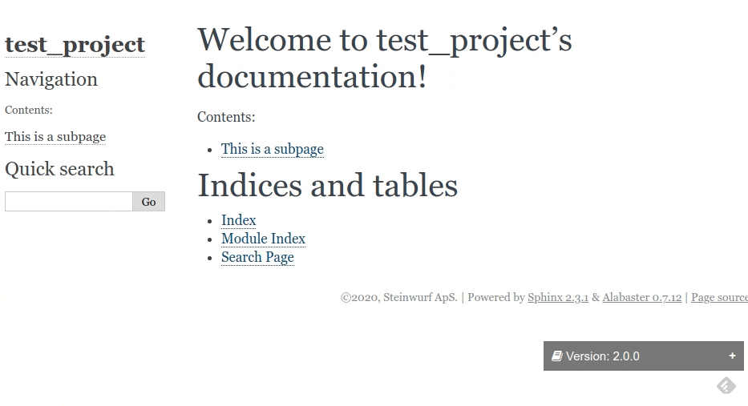

Introduction
============

|PyPi| |Waf Python Tests| |Black| |Flake8| |Pip Install|

.. |PyPi| image:: https://badge.fury.io/py/versjon.svg
    :target: https://badge.fury.io/py/versjon

.. |Waf Python Tests| image:: https://github.com/steinwurf/versjon/actions/workflows/waf.yml/badge.svg
   :target: https://github.com/steinwurf/versjon/actions/workflows/waf.yml

.. |Flake8| image:: https://github.com/steinwurf/versjon/actions/workflows/flake8.yml/badge.svg
    :target: https://github.com/steinwurf/versjon/actions/workflows/flake8.yml

.. |Black| image:: https://github.com/steinwurf/versjon/actions/workflows/black.yml/badge.svg
      :target: https://github.com/steinwurf/versjon/actions/workflows/black.yml

.. |Pip Install| image:: https://github.com/steinwurf/versjon/actions/workflows/pip.yml/badge.svg
      :target: https://github.com/steinwurf/versjon/actions/workflows/pip.yml

What it is:

* A tool for linking multiple versions of your project's Sphinx
  documentation, without the need for special services such as readthedocs.org.
* Useful if you build and host your documentation as a static site.

How it works:

* ``versjon`` works by injecting some basic HTML in to the generated
  documentation.

Demonstration
-------------

Installation
------------

1. Install the ``versjon`` tool using ``pip``::

      python -m pip install versjon

Building the docs
-----------------

1. Build all the different versions of your documentation into a common
   directory. For example generating all the docs in the ``site`` directory::

       git checkout 2.0.0
       sphinx-build... -D version=2.0.0 ... site/build_2.0.0

       ...

       git checkout 5.1.1
       sphinx-build... -D version=5.1.1 ... site/build_5.1.1

   ``versjon`` will use whatever ``version`` is specified in the Sphinx
   configuration: https://www.sphinx-doc.org/en/master/usage/configuration.html
   If you have the specified the ``version`` number in ``conf.py`` you can omit
   the ``-D version`` option to Sphinx build.

2. Run ``versjon`` in the common directory - and you are done.

Index page
----------

As default ``versjon`` will generate an ``index.html`` file with a redirect to
the latest stable version, or if no semver version exists the first branch,
presumably the master.
You can disable this behavior with ``--no-index`` option.

Stable index
------------

As default ``versjon`` will generate a folder in the documentation root called
``stable``. This folder will contain an ``index.html`` with a redirect to the
latest stable version. You can disable this behavior with
``--no-stable-index`` option.

Built in templates (injection)
------------------------------

``versjon`` ships with a couple of built-in templates, that get injected
in the generated HTML:

* ``head.html``: This template gets injected into the ``<head>`` tag of
  the generated HTML pages. In this template you have access to the following
  variables: ``general``, ``build``, ``page``.
* ``header.html``: This template is inject at the beginning of the ``<body>``
  tag. In this template you have access to the following variables:
  ``general``, ``build``, ``page``.
* ``footer.html``: This template is inject at the end of the ``<body>``
  tag. In this template you have access to the following variables:
  ``general``, ``build``, ``page``.
* ``index.html``: This template is use to generate an ``index.html``
  in the ``root`` folder.  In this template you have access to the
  following variables: ``general``, ``page``.
* ``stable_index.html``: This template is use to generate an ``index.html``
  in the ``stable`` folder.  In this template you have access to the
  following variables: ``general``, ``page``.

Customization
-------------
You can provide you own template for generating the version selector etc.

The easiest way is probably to copy one of the default HTML templates, e.g.,
``src/templates/footer.html`` one and adapt it.

If you want to "inject" a custom footer. Create a file called ``footer.html``
and put it somewhere in your project, e.g., ``mydocs/footer.html`` now invoke
``versjon`` with the ``--user_templates`` argument, e.g.,::

    ./versjon --user_templates=mydocs

``verjson`` will prioritize finding templates in the users path first. If none
is found it will fallback to the built-in.

If you want to disable a built-in template, simply create an empty file with
the same name as the template you want to disable e.g. ``header.html`` if
the template is empty no content will be injected.

The ``context``
---------------

In the templates you can access the information gathered by versjon. Based on
this you can generate the needed HTML.

The following lists the various variables.

General variables
.................

* ``semver``: A list of version dicts with a name which is a valid sematic
  version numbers, and a list of available files in this version.
* ``other``: A list of version dicts with a name which non-semantic version
  numbers, and a list of available files in this version.
  Typically the ``other`` list will contain branches.
* ``stable``: If we have any semantic version releases the ``stable`` version
  will be the newest release in the ``semver`` list.
* ``docs_path``: Dictionary mapping versions to the build folder for a version
  relative to the documentation root.

Build variables
...............

* ``current``: The current version name
* ``is_semver``: True if the current version follows semantic versioning

Page variables
..............

* ``page_root``: Relative path to the documentation root from a given HTML
  page.
  Concatenating the ``page_root`` with a path in ``docs_path`` will give a
  valid relative link from one HTML page to the root folder of specific
  version.
